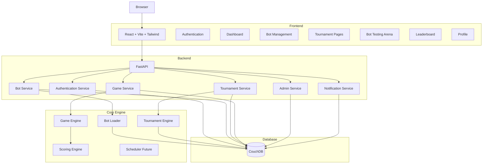
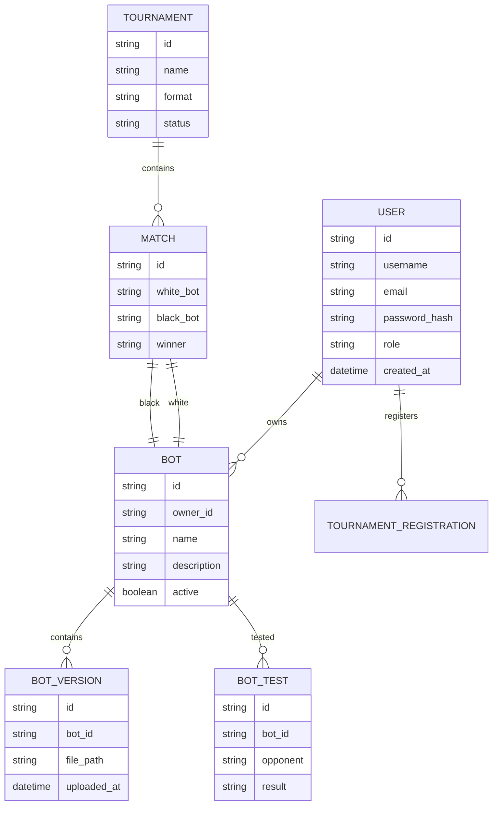
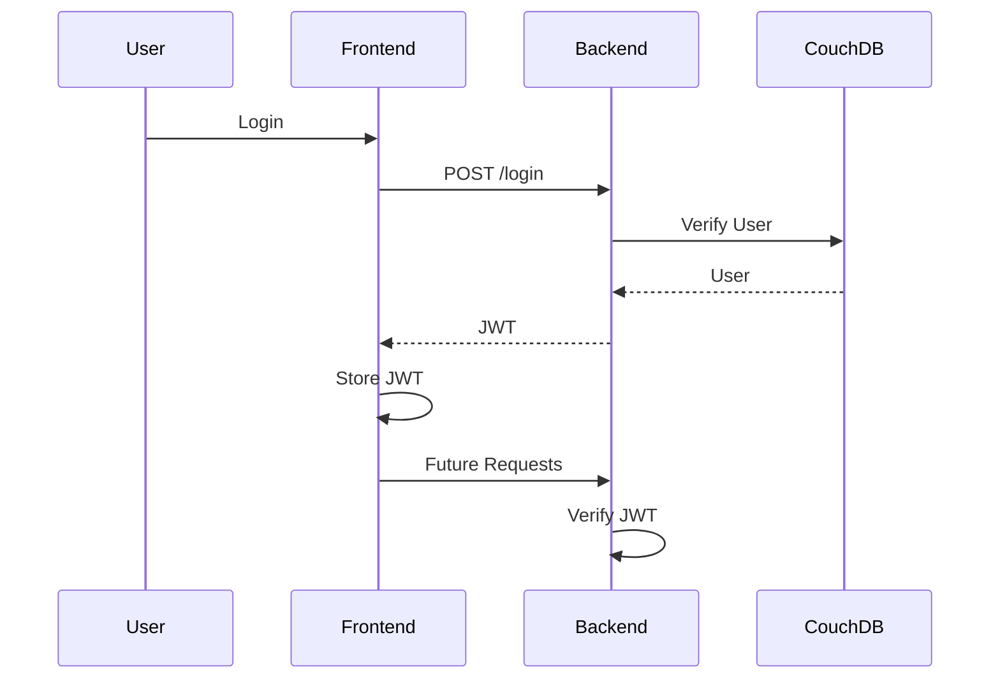
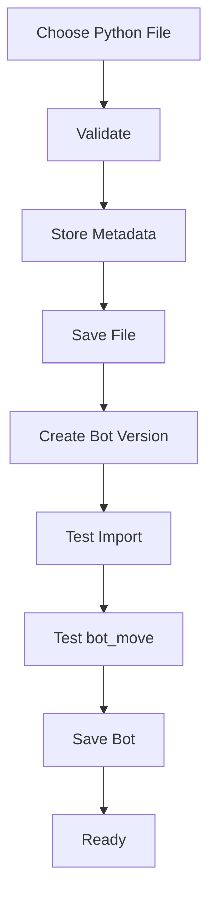
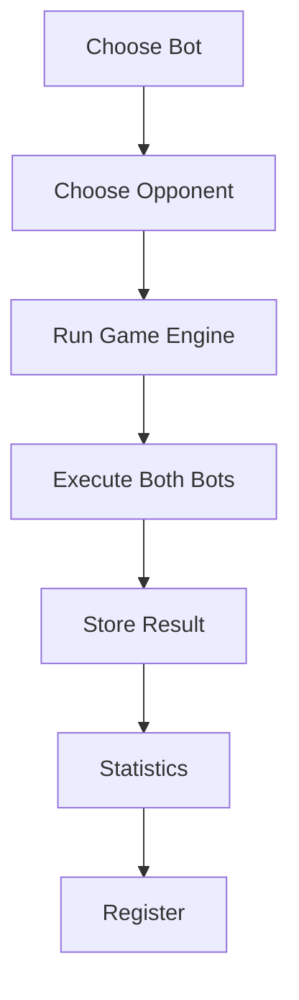

# PahTum AI Competition Platform
## System Architecture v2

---

# Vision

PahTum is no longer only a tournament dashboard.

The goal is to evolve it into a complete AI Competition Platform where multiple users can upload AI bots, test them, register them for tournaments and compete securely.

The architecture must be modular so that future games besides PahTum can be supported.

---

# Overall Architecture



---

# Backend Folder Structure

```text
backend/

config/

auth/

routes/

services/

engines/

database/

storage/

uploads/

utils/

models/

main.py
```

---

# Frontend Folder Structure

```text
frontend/src

pages/

components/

layouts/

api/

hooks/

context/

assets/

styles/
```

---

# CouchDB Collections



---

# Authentication Flow



---

# Bot Upload Flow



---

# Bot Testing Flow



---

# Tournament Flow

```mermaid
flowchart TD

Create Tournament

↓

Open Registration

↓

Users Register One Bot

↓

Registration Closed

↓

Bracket Generated

↓

Matches Scheduled

↓

Bot Execution

↓

Results Stored

↓

Leaderboard Updated

↓

Tournament Ends
```

---

# Admin Flow

```mermaid
flowchart TD

Admin Login

↓

Dashboard

↓

Create Tournament

↓

Manage Users

↓

Manage Bots

↓

Monitor Matches

↓

View Logs

↓

Platform Settings
```

---

# User Dashboard

The dashboard should contain

• Profile

• Statistics

• Notifications

• Active Tournament

• My Bots

• Recent Matches

• Bot Performance

• Registered Tournament

• Quick Actions

---

# Bot Management

Each user can own multiple bots.

Example

User

├── Minimax

├── AlphaBeta

├── MCTS

├── Experimental

└── Final

Only ONE bot may be registered per tournament.

Users may freely test all bots before registration.

---

# Security Rules

Users

✔ Upload bots

✔ Test bots

✔ Register tournaments

✔ View their own bots

Users cannot

✘ View another user's source code

✘ Download another user's bots

✘ Edit another user's bots

Admins

✔ Manage platform

✔ Manage tournaments

✔ Manage users

✔ Monitor logs

---

# Core Engine

These components remain backend-only.

Game Engine

Tournament Engine

Scoring Engine

Bot Loader

Scheduler

They must never be directly accessible from frontend.

---

# Database Rules

Use CouchDB.

Do NOT use db.json.

Read connection information from environment variables.

COUCHDB_URL

COUCHDB_USERNAME

COUCHDB_PASSWORD

COUCHDB_DATABASE

---

# Phase 1

Authentication

Role Based Access

CouchDB

Modern Dashboard

Multiple Bots

Bot Testing Arena

Tournament Registration

Admin Dashboard

Secure Bot Storage

---

# Phase 2

Automatic Match Scheduling

Automatic Tournament Progression

Realtime Updates

WebSockets

Rating System

Analytics

Multiple Games

Spectator Mode

Cloud Deployment

---

# Development Rules

Never rewrite working code unnecessarily.

Reuse existing Game Engine.

Reuse existing Tournament Engine.

Reuse existing Bot Loader.

Only refactor where needed.

Always maintain a runnable application.

Think like a production software architect.
