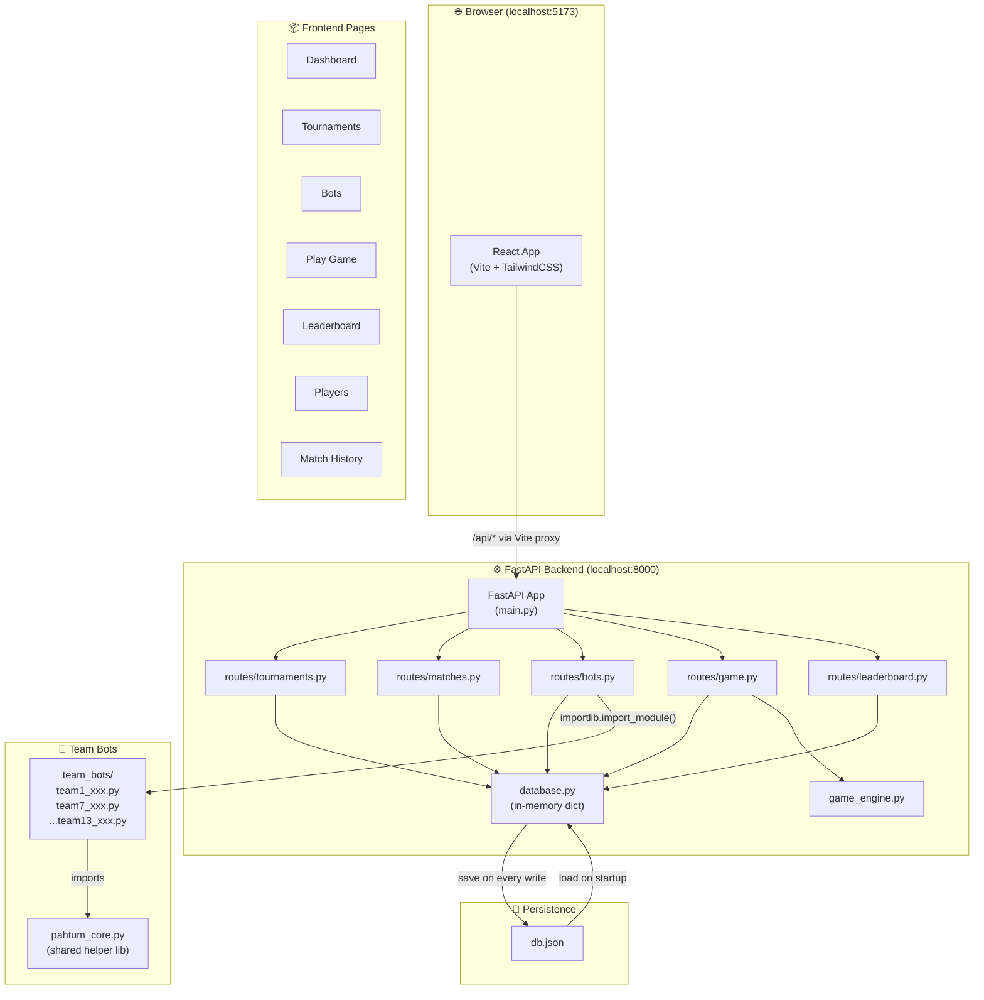
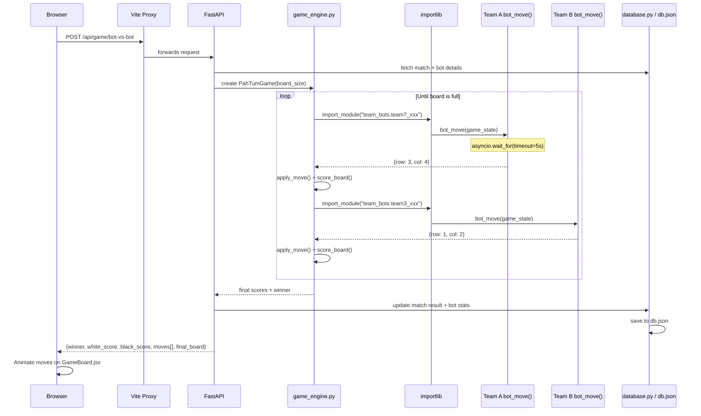
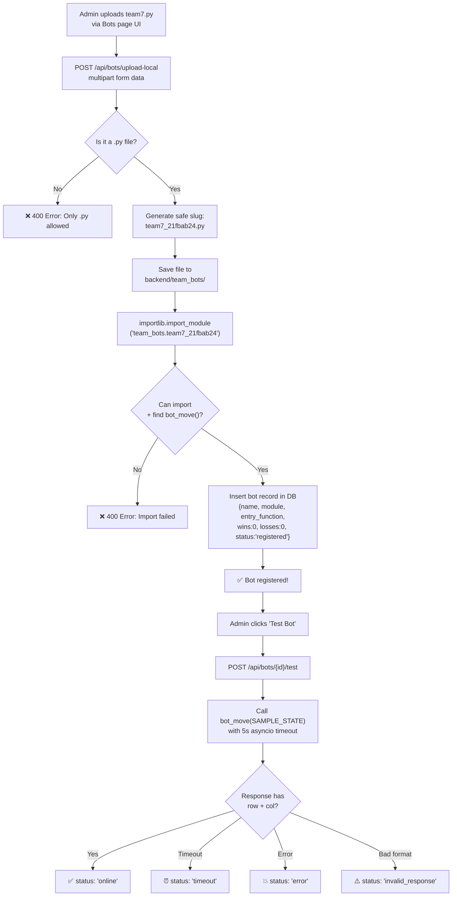
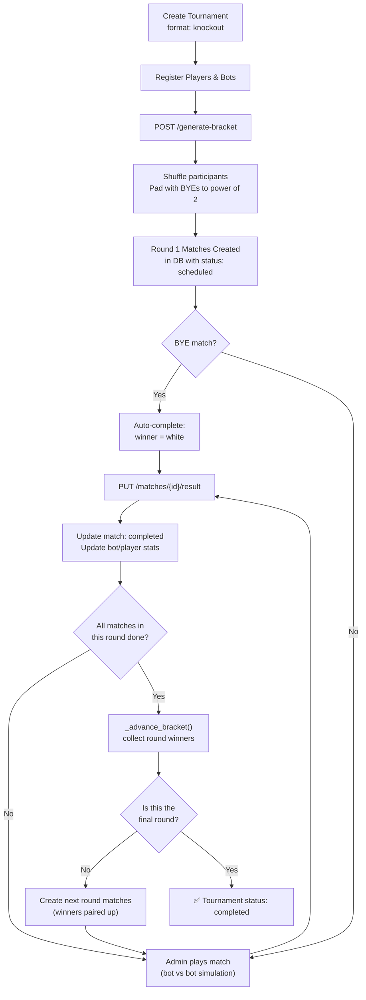
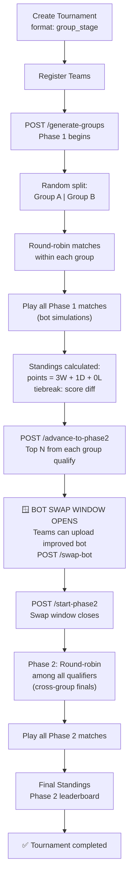
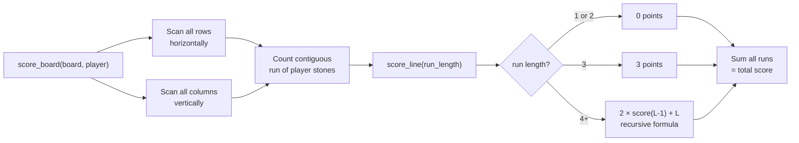
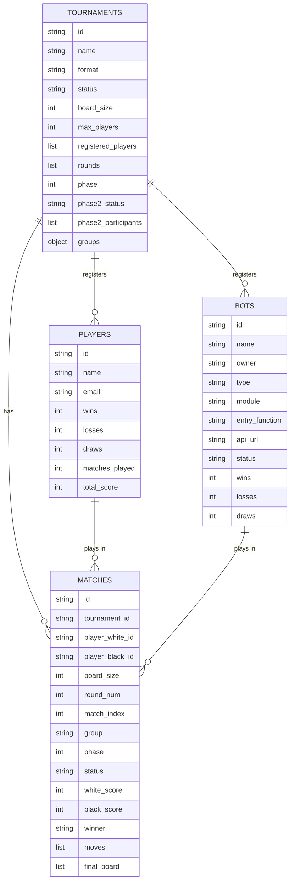
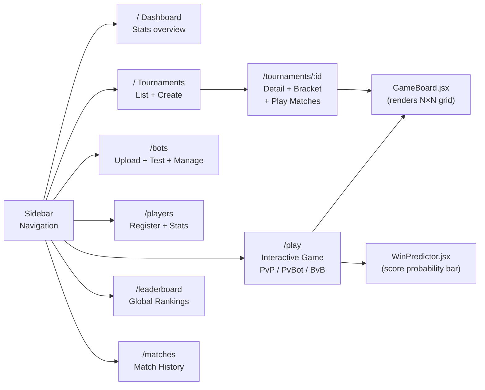

# Pah-Tum Tournament Dashboard — Mermaid Diagrams

---

## 1. 🏗️ Overall System Architecture

---

## 2. 🔄 End-to-End Request Flow (Bot vs Bot Match)

---

## 3. 🤖 Bot Upload & Registration Lifecycle

---

## 4. ⚔️ Knockout Tournament Format

---

## 5. 🏆 Group Stage Tournament Format

---

## 6. 🎮 Game Engine Scoring Logic

---

## 7. 🗄️ Database Schema (db.json collections)

---

## 8. 🔁 Frontend Page Flow (React Router)

